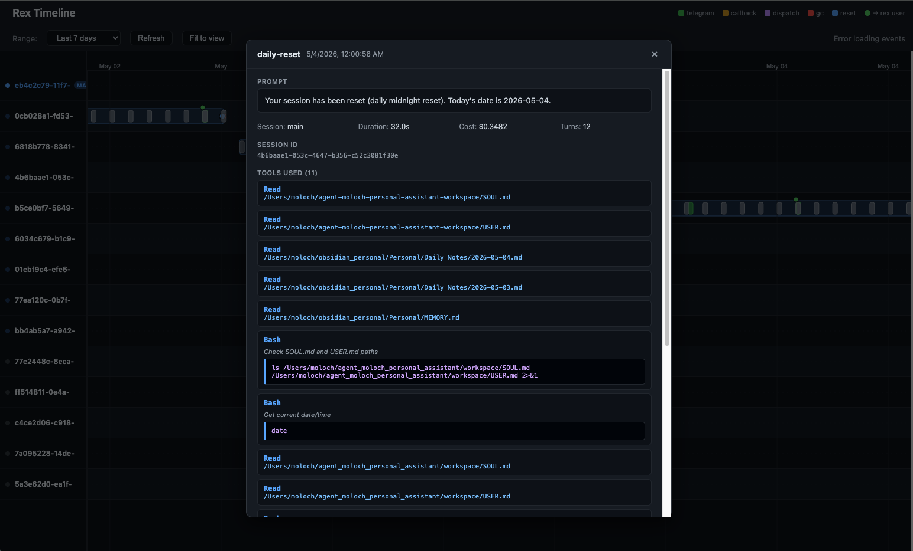

# rex — Claude Code Agent Runner

`rex` is a long-running daemon that drives a Claude Code agent on your behalf.
It accepts prompts from a Telegram bot, dispatches scheduled jobs, exposes a
local web dashboard, and tracks every turn in a queryable timeline.

## Why this exists

I had a personal AI agent (OpenClaw) running my life for a while — cron
jobs, email triage, calendar, the works. Two things eventually nagged me
enough to rewrite it:

1. **It billed by the token via the API.** Pay-per-token never made sense
   for something running 24/7. I already pay for a Claude subscription
   that I live in all day for coding — I wanted the agent on the same
   subscription, not a second meter.
2. **It was a separate world from where I actually work.** Claude Code is
   my daily workhorse; my agent should be running on the same engine, with
   the same tools, the same shell, the same files.

There's also a Feynman line I keep coming back to: *"What I cannot create,
I do not understand."* I wanted to actually understand how this stuff works
under the hood — not just glue someone else's framework together.

## How it works

Most of what an agent runner needs is already inside Claude Code: shell
access, file editing, every CLI tool on the host, the LLM loop itself.
The agent runtime is already there. `rex` is the thin layer around it.

What `rex` adds:

- **An always-on daemon.** Single Go binary that just keeps running.
  No webhook server, no cloud component, no Python deps. Installed under
  `launchd` (macOS) or `systemd` (Linux) via `rex start`.
- **Telegram as the UI.** The daemon speaks the bot protocol natively —
  Telegram *is* the interface, no other UI to maintain. (There's also a
  local web dashboard at `127.0.0.1:9821` for inspecting sessions, events,
  and live agent activity.)
- **Tools for the agent to ping the user.** `rex user text|voice|file`
  lets the agent surface progress, audio replies, or attachments at any
  point — not just at the end of a turn.
- **Tools for the agent to schedule its own callbacks.** `rex callback
  create "<prompt>" --schedule "<cron>"` (or `--at`, `+5m`, …) lets the
  agent wake itself up later, run a prompt, and ping back. Optional
  `--command` runs a pre-check whose stdout feeds into the prompt; a
  non-zero exit skips the run.
- **Session management + recycling.** A `main` session persists across
  messages; auxiliary sessions are tracked, listed, reset, and
  garbage-collected on a 30-minute schedule. Sessions auto-recycle so
  last week's noise doesn't bleed into today's work.
- **A skill system.** Drop reusable instruction packs into
  `workspace/skills/`; the agent enumerates them via `rex skills list`.
- **A timeline store.** Every event is appended to JSONL audit logs and
  indexed in SQLite. The point: nothing the agent does should be a black
  box — `rex timeline` and the dashboard show exactly what happened.

  

What `rex` deliberately does *not* have:

- **A memory layer.** Memory lives in plain markdown files
  (`workspace/agent.md`, `workspace/memory.md`, or wherever you point the
  agent), and the agent reads/writes them with its normal file tools. No
  bespoke schema, no embedding store, no vector DB.
- **A roster of preset subagents.** There's one agent. Different "modes"
  emerge from sessions and skills loaded into the workspace — not from a
  fixed cast of named personas (`code-reviewer`, `researcher`, `planner`,
  …). One brain with context, not a committee.

## Other features

- **Voice in / voice out.** Optional OpenAI-powered speech-to-text for incoming
  voice notes and text-to-speech replies via `rex user voice`.
- **Telegram allow-list.** The bot is pinned to specific Telegram user IDs, so
  only you can drive your agent.
- **Dispatch CLI.** `rex dispatch <session> <message>` sends a prompt into the
  bot pipeline from scripts or other tools.
- **One-shot project setup.** `rex init` scaffolds a `workspace/` with
  `agent.md` and `memory.md`, records the project dir, and runs interactive
  config.

## Install

```bash
./install.sh                # builds and symlinks rex into ~/.local/bin
./install.sh /usr/local/bin # or pick another install dir
```

Requires Go 1.22+.

## Quick start

```bash
cd <your-project>
rex init                    # scaffold workspace/ and run config setup
rex start                   # install + start the daemon
rex status                  # check it's running; opens dashboard URL
```

## Command reference

```text
Setup:      init
Daemon:     serve | start | stop | restart | status | logs [-f]
Config:     config | config setup | config show
Skills:     skills [list]
Timeline:   timeline stats | rebuild | clear
Sessions:   session reset | list | gc
Dispatch:   dispatch <session> <message>
Callbacks:  callback list | create "<prompt>" --schedule|--at … | remove <id>
User:       user text|voice|file <…>
```

Run `rex help` or any subcommand without arguments for full usage.
